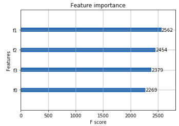

# **Machine Learning Nanodegree Capstone Project**

## **Kaggle Challenge: PetFinder.my Adoption Prediction**

> Mahesh Babu Gorantla - March 15, 2019

- [**Machine Learning Nanodegree Capstone Project**](#machine-learning-nanodegree-capstone-project)
  - [**Kaggle Challenge: PetFinder.my Adoption Prediction**](#kaggle-challenge-petfindermy-adoption-prediction)
  - [**Project Overview**](#project-overview)
  - [**Problem Statement**](#problem-statement)
  - [**Metrics**](#metrics)
  - [**Data Exploration**](#data-exploration)
    - [**Dataset Sample**](#dataset-sample)
    - [**Data Fields**](#data-fields)
    - [**AdoptionSpeed**](#adoptionspeed)
    - [**Images**](#images)
    - [**Image Metadata**](#image-metadata)
    - [**Sentiment Data**](#sentiment-data)
    - [**Dropping Irrelevant Columns**](#dropping-irrelevant-columns)
    - [**Missing Values Per Column**](#missing-values-per-column)
  - [**Exploratory Visualization**](#exploratory-visualization)
    - [**Descriptive Statistics**](#descriptive-statistics)
    - [**Dataset Distribution (per class)**](#dataset-distribution-per-class)
    - [**Understanding the Descriptive Statistics**](#understanding-the-descriptive-statistics)
  - [**Algorithms and Techniques**](#algorithms-and-techniques)
    - [**Choosing Baseline Model**](#choosing-baseline-model)
  - [**Benchmark**](#benchmark)
  - [**Data Preprocessing**](#data-preprocessing)
    - [**1. Transforming Missing Values to None**](#1-transforming-missing-values-to-none)
    - [**2. Imputing the Missing Values**](#2-imputing-the-missing-values)
      - [**Quantitative Columns**](#quantitative-columns)
      - [**Categorical Columns**](#categorical-columns)
    - [**3. Anomalies in Dogs and Cats Data**](#3-anomalies-in-dogs-and-cats-data)
      - [**Anomalies in Dogs Data**](#anomalies-in-dogs-data)
      - [**Anomalies in Cats Data**](#anomalies-in-cats-data)
  - [**Implementation**](#implementation)
  - [**Refinement**](#refinement)
  - [**Model Evaluation and Validation**](#model-evaluation-and-validation)
  - [**Justification**](#justification)
  - [**Free-Form Visualization**](#free-form-visualization)
  - [**Reflection**](#reflection)
    - [**Summary of Workflow Process**](#summary-of-workflow-process)
  - [**Improvement**](#improvement)
  - [**References**](#references)

## **Project Overview**

Each year, approximately 7.6 million companion animals enter the animal shelters nationwide (ASPCA). Of those, approximately 3.9 million are dogs and 3.4 million are cats. About 2.7 million shelter animals are adopted each year (1.4 million dogs and 1.3 million cats). This leaves around two-thirds of pets going unadopted.

This uncertainty of the unadopted pets future is further worsened because many a times a pet shelter's future is typically uncertain and many pet shelters cannot keep the unadopted pets for extended periods of time due to logistical reasons and many of the pet shelters are run voluntarily (mostly dependent on generous donations).

If at all we can find those stray animals a forever home, many precious lives can be given a new life that they truly deserve and in turn we will see more happier families.

I am big fan of pets. My personal motivation to solve this problem explicitly is because doing so will make the [PetFinder.my](https://www.petfinder.my/) Agency streamline their pet adoption services which in turn help more pets being adopted. Being able to predict how quickly a pet will be adopted will help pet adoption agencies optimize their logistics and operate more efficiently reducing the percentage of unadopted pets.

## **Problem Statement**

[PetFinder.my](https://www.petfinder.my/) has been Malaysia's leading animal welfare platform since 2008, with a database of more than 150,000 animals.
PetFinder collaborates closely with animal lovers, media, corporations, and global organizations to improve animal welfare.

The problem at hand currently is to create a model to predict the adoption speed of a pet given its features (mentioned below).

Using a machine learning algorithm(s) to predict the adoption speed of a pet should help us solve the above mentioned problem.

The Pet Adoption Prediction is a multi-class classification problem. In this problem, I need to develop algorithms to predict the adoptability of pets - specifically, how quickly is a pet adopted based on it features (which have been explained in the section below).

It is a classificiation problem because a pet's adoption speed is classified into 5 categories.

A relevant potential solution is to use a few classification algorithms such as

- k-Means Clustering (Baseline model)
- DBSCAN
- Random Forests
- XGBoost

And, choose the one with best `cross_validation` score on the training dataset.

>> Relevant Academic Research has been cited in the `References` section

## **Metrics**

I would like to propose an evaluation metric called `Cross Validation Score`. The simplest way to use cross-validation is to call the `cross_val_score` helper function on the estimator and the dataset.

Given, the problem is to develop a supervised multi-class classification model, the `cross_val_score` method uses `StratifiedKFold` cross-validation technique. `StratifiedKFold` cross-validation method is a variation of `KFold` that returns startified folds. The folds are made by preserving the percentage of samples for each class.

The model whose cross validation score is greater than the benchmark model and with a higher precision will be my solution model.

## **Data Exploration**

The dataset to solve the above mentioned problem has been obtained as a part of Kaggle Challenge. In this problem, I will predict the speed at which a pet is adopted, based on the pet’s listing on PetFinder. Sometimes a profile represents a group of pets. In this case, the speed of adoption is determined by the speed at which all of the pets are adopted. The data included text, tabular, and image data.

### **Dataset Sample**

> Removed `Description` Column due to space constraints

| Type | Name | Age | Breed1 | Breed2 | Gender | Color1 | Color2 | Color3 | MaturitySize | FurLength | Vaccinated | Dewormed | Sterilized | Health |  Quantity | Fee | State | RescuerID | VideoAmt | PetID | PhotoAmt | AdoptionSpeed |
| -- | ----- | ---------- | ---- | ------- | ------- | ------- | ------- | ------- | ------- | ------------- | ---------- | ----------- | --------- | ----------- | ------- | --------- | ---- | ------ | ------------------------------- | --------- | -------------------------------------------------------------------------------------------------------------------------------------------------------------------------------------------------------------------------------------------------------------------------------------------------------------------------------------------------------------------------------------------------------- | -------- | --------- | --------------- |
| 2 | Nibble | 3 | 299 | 0 | 1 | 1 | 7 | 0 | 1 | 1 | 2 | 2 | 2 | 1 | 1 | 100 | 41326 | 8480853f516546f6cf33aa88cd76c379 | 0 | 86e1089a3 | 1 | 2 |
| 2 | No Name Yet | 1 | 265 | 0 | 1 | 1 | 2 | 0 | 2 | 2 | 3 | 3 | 3 | 1 | 1 | 0 | 41401 | 3082c7125d8fb66f7dd4bff4192c8b14 | 0 | 6296e909a | 2 | 0 |
| 1 | Brisco | 1 | 307 | 0 | 1 | 2 | 7 | 0 | 2 | 2 | 1 | 1 | 2 | 1 | 1 | 0 | 41326 | fa90fa5b1ee11c86938398b60abc32cb | 0 | 3422e4906 | 7 | 3 |
| 1 | Miko | 4 | 307 | 0 | 2 | 1 | 2 | 0 | 2 | 1 | 1 | 1 | 2 | 1 | 1 | 150 | 41401 | 9238e4f44c71a75282e62f7136c6b240 | 0 | 5842f1ff5 | 8 | 2 |
| 1 | Hunter | 1 | 307 | 0 | 1 | 1 | 0 | 0 | 2 | 1 | 2 | 2 | 2 | 1 | 1 | 0 | 41326 | 95481e953f8aed9ec3d16fc4509537e8 | 0 | 850a43f90 | 3 | 2 |

> Open [this](https://github.com/maheshbabugorantla/Udacity_Machine_Learning/blob/master/Capstone-Project/Capstone-Project-Report.md#dataset-sample) to clearly see a sample of the dataset

### **Data Fields**

- `PetID`- Unique hash ID of pet profile
- `AdoptionSpeed` - Categorical speed of adoption. Lower is faster. `This is the value to predict`. See below section for more info.

- `Type` - Type of animal ( 1  = Dog, 2  = Cat)
- `Name` - Name of pet (Empty if not named)
- `Age` - Age of pet when listed, in months
- `Breed1` - Primary breed of pet (Refer to BreedLabels dictionary)

- `Breed2` - Secondary breed of pet, if pet is of mixed breed (Refer to BreedLabels dictionary)

- `Gender` - Gender of pet ( 1 = `Male`,  2 = `Female`, 3 = `Mixed`, if profile represents group of pets)

- `Color1` - Color 1 of pet (Refer to ColorLabels dictionary)

- `Color2` - Color 2 of pet (Refer to ColorLabels dictionary)

- `Color3` - Color 3 of pet (Refer to ColorLabels dictionary)

- `MaturitySize` - Size at maturity ( 1  = `Small`,  2  = `Medium`,  3  = `Large`,  4  = `Extra Large`,  0  = `Not Specified`)

- `FurLength` - Fur length ( 1 = `Short`, 2 = `Medium`, 3 = `Long`, 0 = `Not Specified`)

- `Vaccinated` - Pet has been vaccinated ( 1 = `Yes`,  2 = `No`, 3 = `Not Sure`)

- `Dewormed` - Pet has been dewormed ( 1 = `Yes`, 2 = `No`, 3 = `Not Sure`)

- `Sterilized` - Pet has been `spayed` / `neutered` ( 1  = `Yes`, 2 = `No`, 3 = `Not Sure`)

- `Health` - Health Condition ( 1 = `Healthy`, 2 = `Minor Injury`, 3 = `Serious Injury`, 0 = `Not Specified`)

- `Quantity` - Number of pets represented in profile
Fee - Adoption fee ( 0 = `Free`)

- `State` - State location in Malaysia (Refer to StateLabels dictionary)

- `RescuerID` - Unique hash ID of rescuer

- `VideoAmt` - Total uploaded videos for this pet

- `PhotoAmt` - Total uploaded photos for this pet

- `Description` - Profile write-up for this pet. The primary language used is English, with some in Malay or Chinese.

### **AdoptionSpeed**

Contestants are required to predict this value. The value is determined by how quickly, if at all, a pet is adopted. The values are determined in the following way:

- `0` - Pet was adopted on the same day as it was listed.
- `1` - Pet was adopted between 1 and 7 days (1st week) after being listed.
- `2` - Pet was adopted between 8 and 30 days (1st month) after being listed.
- `3` - Pet was adopted between 31 and 90 days (2nd & 3rd month) after being listed.
- `4` - No adoption after 100 days of being listed. (There are no pets in this dataset that waited between 90 and 100 days)

### **Images**

For pets that have photos, they will be named in the format of *`PetID-ImageNumber.jpg`*. Image $1$ is the profile (`default`) photo set for the pet. For privacy purposes, faces, phone numbers and emails have been masked.

### **Image Metadata**

We have run the images through **`Google's Vision API`**, providing analysis on `Face Annotation`, `Label Annotation`, `Text Annotation` and `Image Properties`. You may optionally utilize this supplementary information for your image analysis.

File name format is *`PetID-ImageNumber.json`*.

Some properties will not exist in JSON file if not present, i.e. Face Annotation. Text Annotation has been simplified to just 1 entry of the entire text description (instead of the detailed JSON result broken down by individual characters and words). Phone numbers and emails are already anonymized in Text Annotation.

Google Vision API reference: https://cloud.google.com/vision/docs/reference/rest/v1/images/annotate

<a name='sentiment-data'>

### **Sentiment Data**

We have run each pet profile's description through **`Google's Natural Language API`**, providing analysis on sentiment and key entities. You may optionally utilize this supplementary information for your pet description analysis. There are some descriptions that the API could not analyze. As such, there are fewer sentiment files than there are rows in the dataset.

File name format is *`PetID.json`*.

Google Natural Language API reference: https://cloud.google.com/natural-language/docs/basics

### **Dropping Irrelevant Columns**

- `Name`, `PetID`, `RescuerID`
  - It makes sense to not have `Name` column because it does not help us predict how faster a pet animal will be adopted as we know that any prospective pet owner will not adopt a pet animal based on its name.
  - Likewise `PetID`, `RescuerID` also have no relevance to the task at hand

- However, for now to simplify the modeling let's ignore the following columns
  - `Fee` - Might have some implication if a pet will adopted (Need to check the correlation)
  - `State` - Might not influence the adoption speed (Need to check the correlation)
  - `VideoAmt`, `PhotoAmt` & `Description` - Will have some impact on the adoption speed. Because a beautiful looking pet might get adopted sooner. But just to make the modeling simpler let's ignore these columns as well for now.

### **Missing Values Per Column**

A common abnormality found in datasets is `missing values`

| Column Name     |   No. of Missing Values |
|-----------------|-------------------------|
|     `Type`      |             0           |
|     `Name`      |          1257           |
|     `Age`       |             0           |
|     `Breed1`    |             0           |
|     `Breed2`    |             0           |
|     `Gender`    |             0           |
|     `Color1`    |             0           |
|     `Color2`    |             0           |
|     `Color3`    |             0           |
|    `FurLength`  |             0           |
|   `Vaccinated`  |             0           |
|   `Dewormed`    |             0           |
|   `Sterilized`  |             0           |
|   `Health`      |             0           |
|   `Quantity`    |             0           |
|   `Fee`         |             0           |
|   `State`       |             0           |
|   `RescuerID`   |             0           |
|   `VideoAmt`    |             0           |
|   `Description` |            12           |
|   `PetID`       |             0           |
|   `PhotoAmt`    |             0           |
| `AdoptionSpeed` |             0           |

Very often rows with missing values will be dropped as anomalies in the data however, given that the dataset only has `14,993` datapoints removing `1269` rows we are almost throwing away nearly `10%` of the data which will not be an ideal operation to perform as a part of data cleaning process.

However as mentioned above, the columns `Name` and `Description` are being dropped as irrelevant columns for the problem at hand. Hence, we are effectively removing anomalies instead of completely deleting the other columns that are needed.

## **Exploratory Visualization**

### **Descriptive Statistics**

Glimpse of Descriptive Statistics of the dataset

|           | Type     | Age      | Breed1  | Breed2  | Gender   | Color1  | Color2  | Color3  | MaturitySize | FurLength | Vaccinated | Dewormed | Sterilized | Health   | Quantity | AdoptionSpeed |
|-----------|----------|----------|---------|---------|----------|---------|---------|---------|--------------|-----------|------------|----------|------------|----------|----------|---------------|
| **count** | 14993    | 14993    | 14993   | 14993   | 14993    | 14993   | 14993   | 14993   | 14993        | 14993     | 14993      | 14993    | 14993      | 14993    | 14993    | 14993         |
| **mean**  | 1.45761  | 0.871006 | 265.273 | 74.0097 | 1.77616  | 2.23418 | 3.22284 | 1.88201 | 1.862        | 1.46748   | 1.73121    | 1.55873  | 1.91423    | 1.03662  | 1.57607  | 2.51644       |
| **std**   | 0.498217 | 1.51298  | 60.0568 | 123.012 | 0.681592 | 1.74523 | 2.74256 | 2.98409 | 0.547959     | 0.59907   | 0.667649   | 0.695817 | 0.566172   | 0.199535 | 1.47248  | 1.17726       |
| **min**   | 1        | 0        | 0       | 0       | 1        | 1       | 0       | 0       | 1            | 1         | 1          | 1        | 1          | 1        | 1        | 0             |
| **25%**   | 1        | 0.166667 | 265     | 0       | 1        | 1       | 0       | 0       | 2            | 1         | 1          | 1        | 2          | 1        | 1        | 2             |
| **50%**   | 1        | 0.25     | 266     | 0       | 2        | 2       | 2       | 0       | 2            | 1         | 2          | 1        | 2          | 1        | 1        | 2             |
| **75%**   | 2        | 1        | 307     | 179     | 2        | 3       | 6       | 5       | 2            | 2         | 2          | 2        | 2          | 1        | 1        | 4             |
| **max**   | 2        | 21.25    | 307     | 307     | 3        | 7       | 7       | 7       | 4            | 3         | 3          | 3        | 3          | 3        | 20       | 4             |

> Open [this](https://github.com/maheshbabugorantla/Udacity_Machine_Learning/blob/master/Capstone-Project/Capstone-Project-Report.md#descriptive-statistics) to clearly see descriptive statistics

### **Dataset Distribution (per class)**

| Adoption Speed | Data Points Size |
|----------------|------------------|
|       0        |       410        |
|       1        |       3090       |
|       2        |       4037       |
|       3        |       3259       |
|       4        |       4197       |

From the above observations we can determine that the dataset is almost **`imbalanced`**.

### **Understanding the Descriptive Statistics**

Just by glancing at the above table, columns `Age`, `Breed1`, `Color 2` & `Color 3` standout especially.

Because the `min` value in each of the above mentioned columns is `0`.

- **`Age`** of `0` years is an abnormal value
  - This indicates that the value for age is missing
  - Need to replace the `0` with `None`

- **`Breed1`** number `0` is an abnormal value.
  - `BreedID` for Dogs ranges from `1` - `241`
  - `BreedID` for Cats ranges from `242` - `307`
  - `Breed2` value of `0` indicates the pet is pure breed

- **`Color2`** & **`Color3`** has color `0`

  - `ColorID` ranges from `1` - `7`

      | Color  | ColorID |
      |--------|---------|
      | Black  | `1`     |
      | Brown  | `2`     |
      | Golden | `3`     |
      | Yellow | `4`     |
      | Cream  | `5`     |
      | Gray   | `6`     |
      | White  | `7`     |

## **Algorithms and Techniques**

Predicting `AdoptionSpeed` of a pet animal in the PetFinder's Animal Database is a supervised multi-class classification problem. To predict `AdoptionSpeed` based on the training features of a pet, I would like to experiment with classification algorithms like

1. Classfication and Regression Trees (CART)
2. kNN Classifier (**Baseline Model**)
3. Support Vector Machines (SVM)
4. Random Forests
5. XGBoost

to predict the adaptability of a pet.

### **Choosing Baseline Model**

A very crude baseline model can be just an educated guess based on the `multi-class` prediction variable distribution. Using the dataset distribution as mentioned above, just by guessing the `AdoptionSpeed` as `4` will get us an accuracy of `27.99%`.

Any of the classification models (from the above) that will beat the aforementioned crude prediction model (based on educated guessing) even by a narrow margin will be my baseline classification model.

Given the number of training features of a pet, `CART` classification model is very crude to capture enough variance in the given dataset.

Hence, I chose to use `kNN` classification model as my baseline model

## **Benchmark**

As we know that the above mentioned prediction task is a supervised classification problem, we should use tree based classification models which typically outperform other classification models. Hence, I would like to use `kNN Classfier` algorithm as a benchmark and beat the benchmark performance both in terms of time to fit the model as well as increase in the prediction accuracy.

Based on my previous experience with solving the classification problems I have observed that usually `XGBoost` is very consistent with giving better classification accuracy. Hence, I have hypothesized the same performance to be delivered by the `XGBoost` algorithm for the given problem.

Currently, the baseline prediction accuracy (without feature transformation) is as follows

| Classification Model | Model Fit Time (in mins) | Cross Validation Accuracy |
|----------------------|--------------------------|---------------------------|
| KNeighborsClassifier | 1.01                     | 31.17%                    |
| XGBoost              | 0.99                     | 38.01%                    |

## **Data Preprocessing**

### **1. Transforming Missing Values to None**

Lets [revisit](#understanding-the-descriptive-statistics) the abnormalities detected while examining the descriptive statistics again. The aforementioned abornamilities are possibly present in the data due to some human error or it is missing data.

> If no documentation is available, some common values used instead of missing values are:
> - **0** (for numerical values)
> - **unknown** or **Unknown** (for categorical variables
> - **?** (for categorical variables)

Number of missing values after transforming the missing values (abnormal) to `None` are

| Column        | Missing Values Count |
|---------------|----------------------|
|Type           |           0          |
|Age            |         179          |
|Breed1         |           5          |
|Breed2         |           0          |
|Gender         |           0          |
|Color1         |           0          |
|Color2         |        4471          |
|Color3         |       10604          |
|MaturitySize   |           0          |
|FurLength      |           0          |
|Vaccinated     |           0          |
|Dewormed       |           0          |
|Sterilized     |           0          |
|Health         |           0          |
|Quantity       |           0          |
|AdoptionSpeed  |           0          |

The maximum number of rows that will be missing if we chose to drop the rows with missing values in a column is `10604` (i.e. we will lose around `70.73%` data).

Losing `70.73%` data is not ideal to solve the problem at hand. We need to impute the missing data (columns) using custom `Quantitative` and `Categorical` imputing methods.

### **2. Imputing the Missing Values**

#### **Quantitative Columns**

To impute the `Quantitative` columns (`Age`), I have used respective `mean` values per column to impute the missing values.

#### **Categorical Columns**

To impute the `Categorical` columns (`Breed1`, `Color1`, `Color2`), I I have used the most frequently occuring (`mode`) category for respective categorical columns.

### **3. Anomalies in Dogs and Cats Data**

#### **Anomalies in Dogs Data**

In 4th row, 3rd column, `Type` column should be `1` for all the dog breeds. However, we can see that some rows of data with `dog` breeds have been marked as `cats`.

There are `36` dogs that are mislabelled as cats

#### **Anomalies in Cats Data**

In 4th row, 3rd column, `Type` column should be `2` for all the cat breeds. However, we can see that almost `50%` of data rows with `cat` breeds have been marked as `dogs`.

The above mentioned anomaly can assumed to be because of human errors often seen in manual data collection/entry process

There are `5927` cats that are mislabelled as dogs.

To correct such anomalies we need to make sure that all the rows whose `Breed1` values belong to cats breeds need to be marked with `2` and likewise mark dog breeds with `1`

## **Implementation**

Theoretical Workflow for implementing the Solution Model

- **Import the Training Dataset**
  - Load the necessary libraries such as `numpy`, `pandas`
  - Load the `data/train/train.csv` dataset
  - Drop irrelevant columns

- **Data Exploration**
  - Find missing rows in the each column using `df.isnull().sum()`
  - Obtain and Understand Descriptive Statistics

- **Feature Engineering**
  - Decipher more missing values from descriptive statistics (if any)
  - Impute missing values using Custom Quantitative/Categorical Imputers
  - Visualize per column distribution using histograms
  - Find any anomalous data distributions from the plots
  - Dummify Categorical Columns
  - Scale all the columns either by using `z-scaling` (`StandardScaler`) or `min-max scaling` (`MinMaxScaler`) technique

- **Evaluate Classification Models**
  - Choose a few classification models
  - Split the dataset into train/split test using `StratifiedKFold` cross-validation technique
  - Score each classification model using `cross_val_score`
  - Choose the classification model with best cross validation score

- **Feature Transformation**
  - Reduce the dimensionality of features
    - Using LDA - Linear Discriminant Analysis (Best for multi-class classification)

- **Tune the Classification Model**
  - Use `GridSearchCV` to improve the accuracy

- **Save the best model**
  - with best prediction time and accuracy

## **Refinement**

Steps used to improve the prediction accuracy of the classification model.

1. PreProcess the Data (as mentioned in the Feature Engineering)
2. Transform the input features to reduce the dimensionality of the `input` data using `LDA - Linear Discriminant Analysis (Best for multi-class classification)`
3. Used `n_components = 5` to transform the data using LDA
4. Obtain the prediction accuracy of classification using kNN Classifier (baseline model)
5. Use `GridSearchCV` method to best parameter set for `XGBoost Classifier` algorithm that will result in a better prediction accuracy than `kNN Classifier`

**Initial Results without Feature Transformation**

| Classification Model | Model Fit Time (in mins) | Cross Validation Accuracy |
|----------------------|--------------------------|---------------------------|
| KNeighborsClassifier | 1.01                     | 31.17%                    |
| XGBoost              | 0.99                     | 38.01%                    |

**Final Results without Feature Transformation**

| Classification Model | Model Fit Time (in mins) | Cross Validation Accuracy |
|----------------------|--------------------------|---------------------------|
| KNeighborsClassifier | 0.03                     | 57.35%                    |
| XGBoost              | 0.023                    | 59.60%                    |

## **Model Evaluation and Validation**

`GridSearch Cross-Validation` technique is utilized to evaluate the `XGBoost` model parameters and pick the best parameters that will give a higher `cross-validation` score of `59.6%` for the classification model.

Here are the parameters that give us the best cross validation score

| XGBClassifier Parameter | Value              |
|-------------------------|--------------------|
| `objective`             | multi:softmax      |
| `subsample`             | 0.7000000000000001 |
| `max_depth`             | 5                  |
| `colsample_bytree`      | 0.5                |
| `scale_pos_weight`      | 0.5                |

The classification model can be called robust if it has a higher precision and low recall in my scenario. It is very highly required for the pet adoption agencies to precisely predict the adoption speed of a pet animal given its features to optimize their logistics. It is not okay to have higher recall because that will lead to a bad logistics management as well as it will be a bad experience for the pet owners

The model with a higher `F1 Score` will be an ideal robust model because it is higher precision and lower recall

Currently the model has an `F1 Score` of `68.08%` which is an indication of higher precision.

## **Justification**

My solution model has a way better cross validation score and lesser model fit time than benchmark model

| Classification Model | Model Fit Time (in mins) | Cross Validation Accuracy |
|----------------------|--------------------------|---------------------------|
| KNeighborsClassifier | 1.01                     | 31.17%                    |
| XGBoost              | 0.023                    | 59.60%

As we can observe that the solution model has much better prediction accuracy than just educated guessing or benchmark model. Hence, the solution model should be able to provide significant help to the pet adoption agency in predicting a pet animals adoption speed.

## **Free-Form Visualization**

> A visualization has been provided that emphasizes an important quality about the project with thorough discussion. Visual cues are clearly defined.

From the above XGBoost Graph Tree Visualization we can observe that there are two derived features `f0` and `f2` that influence a significant portion of the classification accuracy. Here is an another plot that corraborates the above evidence

According the research articles referenced below, what makes a pet more adoptable is its `cuteness`, `health` condition and if it is not `neutered`. Because I have discarded the `cuteness` (a derived feature from pet images) to make the problem simpler to solve. It is very possible that those 2 features (`f0` and `f2`) that significantly influence the adoption speed should be a pet's `Health` and `Sterilized` features (or derived features using both the primitive features).

## **Reflection**

### **Summary of Workflow Process**

1. Initially, reviewed prior literature using research journals to gain a superficial understanding of the pet adoption problem
2. Download the public dataset from Kaggle that helps to solve the problem
3. Determine and resolve anomalies/missing data if any (PreProcessing step)
4. Create a Baseline model to prove that the problem is solvable
5. Use a more complex model than baseline model to improve the prediction accuracy of the classification model

Most of the project was very exciting to solve. However to make a giant leap in improving the prediction accuracy I had to investigate for anomalies in the dataset more closely which was the difficult and exciting part of the problem. Rest of the problem followed a typical procedure used to create a good classification model.

## **Improvement**

Initially, to simplify the problem at hand I have ignored a few columns as irrelevant. Among those irrelevant columns are `photos` of a pet and `description` of a pet. From the literature review of the previously published articles on pet adoption it is found that a cuter pet animal has a higher possibility of getting adopted faster and also pets that are not `neutered` are in high-demand for adoption.

From photos, we can compute the cuteness factor of a pet animal and inject those findings as a new feature into our existing feature set as well as perform sentiment analysis of the pet description to extract the sentiment score and use this newly derived feature to help improve the prediction accuracy. The aforementioned derived features when augmented with the original dataset should significantly improve the prediction accuracy.

## **References**

1. Weiss, E., Miller, K., Mohan-Gibbons, H., & Vela, C. (2012). Why Did You Choose This Pet?: Adopters and Pet Selection Preferences in Five Animal Shelters in the United States. Animals, 2(2), 144-159. doi:10.3390/ani2020144

2. Weiss, E., Dolan, E., Garrison, L., Hong, J., & Slater, M. (2013). Should Dogs and Cats be Given as Gifts? Animals, 3(4), 995-1001. doi:10.3390/ani3040995

3. Garrison, L., & Weiss, E. (2014). What Do People Want? Factors People Consider When Acquiring Dogs, the Complexity of the Choices They Make, and Implications for Nonhuman Animal Relocation Programs. Journal of Applied Animal Welfare Science, 18(1), 57-73. doi:10.1080/10888705.2014.943836

4. PetFinder.my Adoption Prediction. (n.d.). Retrieved from https://www.kaggle.com/c/petfinder-adoption-prediction

5. Raschka, S. (2014, August 03). Linear Discriminant Analysis. Retrieved from https://sebastianraschka.com/Articles/2014_python_lda.html

6. Cross-validation: Evaluating estimator performance¶. (n.d.). Retrieved from https://scikit-learn.org/stable/modules/cross_validation.html

7. Sklearn.metrics.f1_score¶. (n.d.). Retrieved from https://scikit-learn.org/stable/modules/generated/sklearn.metrics.f1_score.html#sklearn.metrics.f1_score.html

8. Sklearn.model_selection.cross_val_score¶. (n.d.). Retrieved from https://scikit-learn.org/stable/modules/generated/sklearn.model_selection.cross_val_score.html

9. Sklearn.model_selection.StratifiedKFold¶. (n.d.). Retrieved from https://scikit-learn.org/stable/modules/generated/sklearn.model_selection.StratifiedKFold.html#sklearn.model_selection.StratifiedKFold.html

10. Sklearn.base.TransformerMixin¶. (n.d.). Retrieved from https://scikit-learn.org/stable/modules/generated/sklearn.base.TransformerMixin.html

11. Ozdemir, S., & Susarla, D. (2018). Feature engineering made easy: Identify unique features from your dataset in order to build powerful machine learning systems. Birmingham, UK: Packt Publishing
